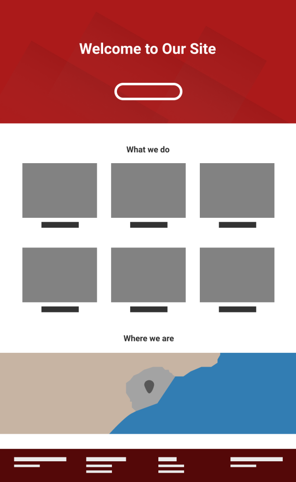
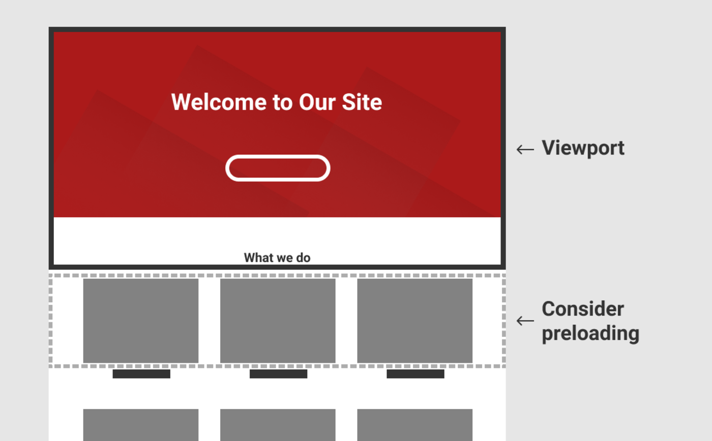
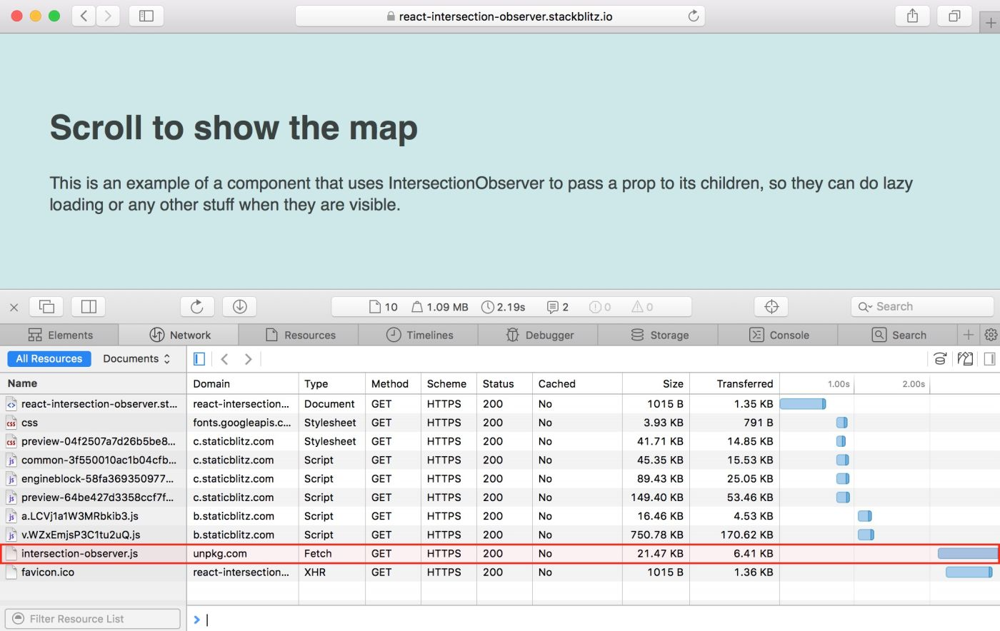

import { CodeSurfer } from 'mdx-deck-code-surfer'
export { future as theme } from 'mdx-deck/themes'
import { Split } from 'mdx-deck/layouts'
import { Appear, Image } from 'mdx-deck'
import nightOwl from "prism-react-renderer/themes/nightOwl"

# Increase the Performance of your Site with Lazy-Loading and Code-Splitting

Stockholm ReactJS Meetup - September 2018
---
# About me

👋 I'm Jose and I work as Engineering Manager in Spotify

I like building & using web sites with good performance

[@jmperezperez](https://twitter.com/jmperezperez) on Twitter

---
# The era of components
---
## What we'll talk about
<ol>
<Appear>
<li>Composition Patterns</li>
<li>Improving performance of our sites by loading only what is needed</li>
<li>A small component to detect visibility</li>
<li>More use cases</li>
<li>Polyfilling IntersectionObserver on-demand</li>
<li>Code Splitting and CSS-in-jsx</li>
<li>Useful implementations</li>
</Appear>
</ol>
---
## Compositional Patterns
---
<CodeSurfer
  title="High Order Components"
  theme={nightOwl}
  code={require("!raw-loader!./snippets/comp-pattern-hoc.mdx")}
  />
---
<CodeSurfer
  title="Function as Child Component aka Render Callback"
  theme={nightOwl}
  code={require("!raw-loader!./snippets/comp-pattern-child.mdx")}
  />

---
## Improving performance of our sites by loading only what is needed
---
export default Split



```jsx
const Page = () => {
  <div>
    <Header />
    <Gallery />
    <Map />
    <Footer />
  </div>;
};
```
---
Most times you would include all the scripts and CSS needed to render all sections as soon as the user visits the page. Until recently it was difficult to define a module’s dependencies, and load what was needed.
---
- How likely is it for the user to see the header?
- What about the map?
---
- Yahoo's YUI Loader
- Facebook's Haste, Bootloader and Primer
---
## Lazy-Loading has trade-offs too
---
export default Split


Don’t lazy load above the fold
---
export default Split



Lazy load a bit earlier than when it’s needed
---
Invisible content in some scenarios

- printing the page
- RSS readers
- SEO

---
## A small component to detect when an area is visible
---
<CodeSurfer
  title="Function as Child Component aka Render Callback"
  theme={nightOwl}
  code={require("!raw-loader!./snippets/comp-basic.mdx")}
  />
---
<CodeSurfer
  title="Using it"
  theme={nightOwl}
  code={require("!raw-loader!./snippets/comp-basic-use.mdx")}
  />
---
make sure that you reserve the area for the lazy-loaded component
---
<CodeSurfer
  theme={nightOwl}
  code={require("!raw-loader!./snippets/map.mdx")}
  />
---
<CodeSurfer
  theme={nightOwl}
  code={require("!raw-loader!./snippets/gallery.mdx")}
  />
---
## Stateless Child Components
---
<CodeSurfer
  theme={nightOwl}
  code={require("!raw-loader!./snippets/gallery-stateless.mdx")}
  />
---
```jsx
const Page = () => {
  ...
  <Observer>
    {(isVisible, hasBeenVisible) =>
      <Gallery hasBeenVisible /> // Gallery can be now stateless
    }
  </Observer>
  ...
}
```
---
```jsx
class ObserverOnce extends Component {
  constructor() {
    super();
    this.state = { hasBeenVisible: false };
    this.io = null;
    this.container = null;
  }
  componentDidMount() {
    this.io = new IntersectionObserver(entries => {
      entries.forEach(entry => {
        if (entry.isIntersecting) {
          this.setState({ hasBeenVisible: true });
          this.io.disconnect();
        }
      });
    }, {});
    this.io.observe(this.container);
  }
  componentWillUnmount() {
    if (this.io) {
      this.io.disconnect();
    }
  }
  render() {
    return (
      <div
        ref={div => {
          this.container = div;
        }}
      >
        {Array.isArray(this.props.children)
          ? this.props.children.map(child => child(this.state.hasBeenVisible))
          : this.props.children(this.state.hasBeenVisible)}
      </div>
    );
  }
}
```
---
## More use cases
---
```jsx
class ConferenceData extends Component {
  constructor() {
    super();
    this.state = { progress: 0 };
    this.interval = null;
    this.animationDuration = 2000;
    this.startAnimation = null;
  }
  componentWillReceiveProps(nextProps) {
    if (
      !this.props.isVisible &&
      nextProps.isVisible &&
      this.state.progress !== 1
    ) {
      this.startAnimation = Date.now();
      const tick = () => {
        const progress = Math.min(
          1,
          (Date.now() - this.startAnimation) / this.animationDuration
        );
        this.setState({ progress: progress });
        if (progress < 1) {
          requestAnimationFrame(tick);
        }
      };
      tick();
    }
  }
  render() {
    return (
      <div>
        {Math.floor(this.state.progress * 3)} days ·
        {Math.floor(this.state.progress * 21)} talks ·
        {Math.floor(this.state.progress * 4)} workshops ·
        {Math.floor(this.state.progress * 350)} attendees
      </div>
    );
  }
}
```
---
## Polyfilling IntersectionObserver on-demand
---

Disabling lazy-loading if IntersectionObserver is not supported

```jsx
class Observer extends Component {
  constructor() {
    super();
    // isVisible is initialized to true if the browser
    // does not support IntersectionObserver API
    this.state = { isVisible: !(window.IntersectionObserver) };
    this.io = null;
    this.container = null;
  }
  componentDidMount() {
    // only initialize the IntersectionObserver if supported
    if (window.IntersectionObserver) {
      this.io = new IntersectionObserver(entries => {
        ...
      }
    }
  }
}
```
---

Requesting a polyfill on demand

```jsx
class Observer extends Component {
  ...
  componentDidMount() {
    (window.IntersectionObserver
      ? Promise.resolve()
      : import('intersection-observer')
    ).then(() => {
      this.io = new window.IntersectionObserver(entries => {
        entries.forEach(entry => {
          this.setState({ isVisible: entry.isIntersecting });
        });
      }, {});
      this.io.observe(this.container);
    });
  }
  ...
}
```
---

Safari requests the polyfill for intersection-observer on demand.



 No need to ship it to browsers that support it natively.

---
## Code Splitting and CSS-in-JS
- react-router and Next.js have made code-splitting easy to implement
- lazy-loading can be applied to other resources (SVGs, CSS)
- With CSS-in-JS we take code splitting further, loading CSS on demand.
---
## Useful implementations
- [thebuilder/react-intersection-observer](https://github.com/thebuilder/react-intersection-observer)
- [researchgate/react-intersection-observer](https://github.com/researchgate/react-intersection-observer)
---
## Conclusion
Componentization makes code-splitting and loading assets on-demand easier than ever!
---
## Interested in joining Spotify?
Talk with me about open positions